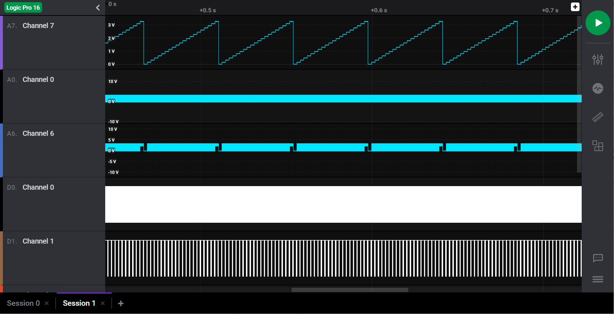

# Logic 2 Extensions

The Logic 2.x software supports custom high level analyzers, digital measurements, and analog measurements, written in python.

## API Change Log

Logic 2.2.9

- Added python measurements as a new type of extension
- Added settings support to HLAs.

Logic 2.2.6

- Very first release of extensions, starting with High Level Analyzers!

## Getting started with Extensions

### Creating a New Extension from Template


Starting a new extension is easy! This section will walk though creating a "High Level Analyzer" from a template, but the process is identical for custom measurements.

First, install and open the latest version of the Logic software. Then, open the new extensions sidebar panel.

From there, click the "+" button in the upper right. This will open the "Create an Extension" dialog. Here you can either create a new extension from a template, or load an existing extension from disk.

To create a high level analyzer, select "HighLevelAnalyzer" from the dropdown, and press "Save As...". This will create a new folder with a basic extension with the name you provide.

This will also load your extension into the software. To see it in action, capture some data that contains protocol data. (Serial, I2C, or SPI).

Then, add the correct analyzer for your data (Serial, I2C, and SPI are supported). Once you've configured the built-in analyzer to decode the raw bytes of your capture, you can add your new HLA. From the same add analyzer menu, now locate your new HLA. It will probably be 4th in the list, right under Serial, I2C, and SPI.

This will open the settings for your HLA. Right now there is only one, the input analyzer. There, you need to select the low-level analyzer you added earlier, Serial, I2C or SPI. Then press finish.

The default HLA template will just copy the frames from the input analyzer to the output. Because it doesn't come with a format string (described below), the graph overlay text you will see on screen will probably look like this: '{type:"data", data:{value:10,...}}'. This conveniently shows you the data format of the input analyzer that you selected, which you will need to access in your HLA. The data format for your input analyzer is also documented below.

Next, open the *.py file you just created in your [favorite text editor](https://code.visualstudio.com/). Use the documentation below to get started! To reload your HLA, you can simply right-click on the instance on the analyzers sidebar, and select "Reload Source Files". This will cause your python file to be re-loaded and re-run over the captured data.

If an error occurs while running your python code, the error message and stack trace will be displayed in a notification.

### Extension File Layout

HLAs require two files, an `extension.json` file, and a python source file.

the `extension.json` file looks like so, and can include one or more extensions - high level analyzers or measurements.

```json
{
    "version": "0.0.1",
    "apiVersion": "1.0.0",
    "author": "Mark \"cool guy\" Garrison",
    "name": "Marks Utilities",
    "extensions": {
        "Fancy I2C": {
            "type": "HighLevelAnalyzer",
            "entryPoint": "util.I2cHla"
        },
        "Text Messages": {
            "type": "HighLevelAnalyzer",
            "entryPoint": "util.TextMessages"
        },
        "voltageData": {
        "type": "AnalogMeasurement",
        "entryPoint": "voltage_statistics.VoltageStatisticsMeasurer",
        "metrics": {
          "voltageRms": {
            "name": "Voltage RMS",
            "notation": "V<sub>RMS</sub>",
            "units": "V"
          }
        }
      }
    }
}
```

The "extensions" object should contain one key for each extension class you would like to write. the "entryPoint" key contains the python file name, a dot, and the python class name, allowing you to write multiple extensions in a single python file, or separate python files. (i.e. `"fileName.className"`)

## Measurements

### Using Measurements

Measurements are a relatively new feature in the alpha software. The gif below demonstrates their use. You can also hold the shift key while dragging on a channel to add a measurement, without using the sidebar.



These measurements automatically run all installed measurements for the given channel type.

### Example Projects

The source code for the two measurements built into the application can be found in this repository:

- [Voltage Statistics (Analog)](./voltageStats)
- [Clock Statistics (Digital)](./clockStats)

*Measurements require the Saleae Logic software version 2.2.9 or newer.*

### Python API Documentation

Digital measurements should be implemented with a class that looks like this:

```py
from saleae.range_measurements import DigitalMeasurer

class MyDigitalMeasurement(DigitalMeasurer):

  def __init__(self, requested_measurements):
    super().__init__(requested_measurements)

  def process_data(self, data):
    for t, bitstate in data:
      pass
  
  def measure(self):
    return {}
```

Analog measurements are similar:

```py
from saleae.range_measurements import AnalogMeasurer

class VoltageStatisticsMeasurer(AnalogMeasurer):

  def __init__(self, requested_measurements):
    super().__init__(requested_measurements)

  def process_data(self, data):
    pass
  
  def measure(self):
    return {}
```

#### Measurement development process

Measurements (both analog and digital) need to compute a set of display values for a specific range of time, over a single channel.

Measurement extensions can produce a list of labeled numbers for display in the UI. These are called "metrics".

Each metric needs to be declared in the extension.json file, like so:

```json
{
    "version": "0.0.1",
    "apiVersion": "1.0.0",
    "author": "Mark \"cool guy\" Garrison",
    "name": "Marks Utilities",
    "extensions": {
        "MyAnalogMeasurement": {
        "type": "AnalogMeasurement",
        "entryPoint": "my_analog_measurement.ExampleMeasurement",
        "metrics": {
          "averageVoltage": {
            "name": "Average Voltage",
            "notation": "V<sub>mean</sub>",
            "units": "V"
          },
          "maxVoltage": {
            "name": "Maximum Voltage",
            "notation": "V<sub>max</sub>",
            "units": "V"
          }
        }
      }
    }
}
```

Each metric needs a single entry in the "metrics" object. That entry needs to contain `name`, `notation`, and `units`.

The `notation` entry can be an html string, however only limited tags are supported: ['b'](https://developer.mozilla.org/en-US/docs/Web/HTML/Element/b), ['i'](https://developer.mozilla.org/en-US/docs/Web/HTML/Element/i), ['em'](https://developer.mozilla.org/en-US/docs/Web/HTML/Element/em), ['strong'](https://developer.mozilla.org/en-US/docs/Web/HTML/Element/strong), ['sub'](https://developer.mozilla.org/en-US/docs/Web/HTML/Element/sub).

The `units` string should not include a metric prefix, as the metric prefix will automatically be calculated. For example, if the unit is frequency, provide "Hz" as a string, and ensure your measurement class always returns a value in Hertz. The Logic software will automatically adjust large or small numbers to display with the correct metric prefix, for example 1000 Hz will be displayed as "1 kHz".

The key of each metric will be passed into your python code, so be sure to keep note of them. In the example json above, those keys are "averageVoltage" and "maxVoltage".

In python, your class will be constructed when the user adds or edits a measurement. This instance of your class will be used for a single computation.

Note - your class can either process analog data or digital data, but not both. A class may handle as many metrics as you want though. If you want to implement both digital and analog measurements, you will need at a minimum two classes.

The constructor will be called with an array of requested measurements, which are taken from the extension.json file. In this example, that will be `["averageVoltage", "maxVoltage"]`.

Your constructor needs to pass this array to the base class:

```py
def __init__(self, requested_measurements):
    super().__init__(requested_measurements)
```

Immediately after construction, the method `def process_data(self, data):` will be called one or more times.

The Saleae Logic software stores collected data in chunks. To keep python processing performant, the Logic software passes these blocks, or sections of these blocks, one at a time to your measurement. If the requested measurement range does not line up with the internal block storage, the objects passed to python will already be adjusted to the measurement range, so no work needs to be done to handle this condition.

This makes it impossible to know exactly how much data will be needed for the given measurement range the first time `process_data` is called. Be sure to update the internal state of your class in such a way that this isn't a problem. For example, when computing the average analog value over a range, it would be best to hold the sum of all values passed to `process_data` and the total count of samples in data members, and only compute the average in the `measure` function.

`def process_data(self, data):`. This function takes a parameter `data` which differs between analog and digital measurements.

For analog measurements, `data` is an instance of the Saleae class `AnalogData`, which is an iterable class with the properties `sample_count` and `samples`.
`sample_count` is a number, and is the number of analog samples in the data instance. Note - this might not be the total number of analog samples passed to your measurement, since `process_data` may be called more than once if the user selected range spans multiple chunks.

`samples` is a [numpy](https://numpy.org/) [ndarray](https://docs.scipy.org/doc/numpy/reference/arrays.ndarray.html). For information handling this type, please refer to the numpy documentation.

The `process_data` function should not return a value. Instead, it should update the internal state of your class, such that the `measure` function can produce your measurement's results.

For digital measurement classes, the `data` parameter is an instance of the iterable Saleae class `DigitalData`. Each iteration returns a pair of values - the current time, as a `GraphTime` class instance, and the current bit state as a boolean. (true = signal high).

The object is essentially a list with the timestamp of each transition inside of the user selected region of digital data.

The `GraphTime` has one feature. one GraphTime can be subtracted from another to compute the difference in seconds, as a number. This allows your code to compute the time in between transitions, or the time duration between the beginning of the measurement and any transition inside of the measurement range, but it does not expose absolute timestamps.

For example, to compute the total number of transitions over the user selected range, this could be used:

```py
def __init__(self, requested_measurements):
  super().__init__(requested_measurements)
  self.first_transition_time = None
  self.edge_count = 0

def process_data(self, data):
    for t, bitstate in data:
        if self.first_transition_time is None:
            self.first_transition_time = t
        else
          # note: the first entry does not indicate a transition, it's simply the bitstate and time at the beginning of the user selected range.
          self.edge_count += 1

```

Currently, the `DigitalData` collection will include every transition that exists in the user selected range, if any. However, it does not yet provide any indication of where the user selected range starts or stops. This is something we're keeping in mind for improvement.

`def measure(self):` will be called on your class once all data has been passed to `process_data`. `measure` will only be called once.

`measure` should return a dictionary with one key for every `requested_measurements` entry that was passed into your class's constructor.

For example, given the original two metrics "averageVoltage" and "maxVoltage", our code could look like:

```py
def __init__(self, requested_measurements):
    super().__init__(requested_measurements)
    self.requested_measurements = requested_measurements

def measure(self):
  values = {}
  if "averageVoltage" in self.requested_measurements:
    values["averageVoltage"] = 1.0
  if "maxVoltage" in self.requested_measurements:
    values["maxVoltage"] = 42.0
  return values
```

Note - in the future, we may allow the user to select which metrics to compute. To avoid unnecessary processing, it's recommended to check the `requested_measurements` provided by the constructor before computing or returning those values. However, returning measurements that were not requested is allowed, the results will just be ignored.

## High Level Protocol Analyzers

*The High Level Analyzer API is likely to change dramatically over the next few months. Always check for updated samples and documentation at [discuss.saleae.com](https://discuss.saleae.com/).*

*We're still working on every part of the HLA system, including the development experience. Keep an eye out for updates!*

Saleae High Level Analyzers (HLAs) allow you to write python code that processes a stream of protocol frames, and produces a new stream of protocol frames.

### Example Projects

- [Gyroscope HLA](./hla_gyroscope)
- [Simple HLA](./hla_simple_example)

*HLAs require the Saleae Logic software version 2.2.6 or newer. HLA settings were introduced in 2.2.9*

### Python API Documentation

To write a HLA, you need to provide a single python class which implements these methods:

```py
class Hla():
  def __init__(self):
    pass

  def get_capabilities(self):
    pass

  def set_settings(self, settings):
    pass

  def decode(self, data):
    return data
```

This example has no settings, and will simply copy the frames from the input analyzer to the output. It also provides no display template, so the default display template will be used.

`def get_capabilities(self):` this user implemented function exposes user-editable settings through the UI. If the HLA does not expose settings, it should be implemented with `pass`

`def set_settings(self, settings):` this function does two things. First, if user editable settings were made available with `get_capabilities`, then the user selections will be passed here through the `settings` argument

second, `def set_settings(self, settings):` can optionally return an object that describes how to format the output frames for display in the software. There should be one entry for every frame "type" your HLA produces.

Lastly, `def set_settings(self, settings):` is called right before `decode` is passed frames from the input analyzer. Any time the HLA is restarted, for instance if the input analyzer changes, or if the user edits any of the HLA's settings, this function will be called again. You should consider this function a reset for your HLA, and clear out any internal state from the previous run here.

`def decode(self, data):` is called once for every frame passed to the HLA from the attached analyzer. It can return nothing, a single frame, or an array of frames.

both the input and the output frames share a common shape. The type is always a python dictionary with the following shape.

```py
{
  "type": "error/address/data/start/stop/etc...",
  "start_time": 0.0052,
  "end_time": 0.0076,
  "data": {
    ...
  }
}
```

For output frames, the "type" key is used to locate the correct format string, if formatting strings are provided by the `set_settings` function return value.

"start_time" and "end_time" show the range of time of the frame, in seconds, relative to the start of the recording. (This is still the case even if a trigger is used, these times will not be relative to trigger time zero)

The "data" key can contain any number of keys, and then can be accessed in the custom format string for the given frame type.

Example:

```py
# Format strings
def set_settings(self, settings):
  return {
      "result_types": {
          "error": {
              "format": "Error!"
          },
          "i2c": {
              "format": "address: {{data.address}}; data[{{data.count}}]: [ {{data.data}} ]"
          }
      }
  }
```

```py
# Example frame of type "error":
def decode(self, data):
  return {
    "type": "error",
    "start_time": 0.0052,
    "end_time": 0.0076,
   "data": {}
  }

# Example frame of type "i2c":
def decode(self, data):
  return {
    "type": "i2c",
    "start_time": 0.0052,
    "end_time": 0.0076,
   "data": {
     "address": 17,
      "data": "0x17, 0x23, 0xFA",
      "count": 3
   }
  }
```

### Exposing Settings through the UI

Logic 2.2.9 introduced user editable settings to the API.

First, the `get_capabilities` function can optionally return a dictionary of settings to show the user.

This function is called once when loading the HLA.

There are tree types of settings. "string", "number", and "choices".

"string" is what is sounds like. It shows a text box to the user and allows them to enter a string.

"number" allows the user to enter a floating point number. Optionally, a minimum and maximum can be enforced.

"choices" lets the user select one of a set of items through a drop down menu.

These settings are returned in a dictionary from the `def get_capabilities(self):` function like so:

```py
  def get_capabilities(self):
    return {
      'settings': {
          'First Setting Label': {
              'type': 'string'
          },
          'Another Setting': {
              'type': 'number',
              'minimum': 1E-6,
              'maximum': 1E4
          },
          'Pick one of the following': {
              'type': 'choices',
              'choices': ('Option A', 'Option B')
          }
      }
  }
```

Specifically, the return value is a dictionary with a single key "settings".

The value of "settings" is another dictionary, where each key is the label of a setting entry that will be displayed to the user.

Each entry is a dictionary.

"string" settings should contain a single key, "type", with the value "string"

"number" settings should contain a key, "type", with the value "number", and optionally supports two more keys, "minimum" and "maximum".

"choices" settings should contain a key, "type", with the value "choices", and anther key, "choices", that should contain an array of strings.

Note, there are no indexes or Ids used in the settings system. The string label of the setting is used as the identifier.

In the case of the "choices" type, the selected string entry will be passed back as the selected entry.

Once the user has made there selections, their entries will be passed into the `def set_settings(self, settings):` method.

For example, the "settings" argument in `set_settings` could be:

```py
settings = {
  'First Setting Label': 'this is a string from the UI!',
  'Another Setting': 42,
  'Pick one of the following': 'Option B'
}
```

Here is an example of how to read this in your HLA:

```py
  def set_settings(self, settings):
    if 'First Setting Label' in settings.keys():
      self.setting1 = settings['First Setting Label']
    if 'Another Setting' in settings.keys():
      self.setting2 = settings['Another Setting']
    if 'Pick one of the following' in settings.keys():
      self.setting3 = settings['Pick one of the following']
```

Note - it's highly recommended to first check settings for each key before reading it. This is because that if you change your analyzer's settings, the UI might try to load the now out-of-date settings from the previous capture automatically, when it migrates analyzers and HLAs from one capture to another.

Another helpful pattern is to hold the specific settings names in global variables, to help avoid typos.

For example:

```py
STRING_SETTING_LABEL = 'First Setting Label'
# ....
  def get_capabilities(self):
    return {
      'settings': {
          STRING_SETTING_LABEL: {
              'type': 'string'
          },
      }
  }
  def set_settings(self, settings):
    if STRING_SETTING_LABEL in settings.keys():
      self.setting1 = settings[STRING_SETTING_LABEL]
```

To access user edited settings in the `def decode(self, data)` method, first save them in class member variables.

### HLA life Cycle

Your HLA class will be constructed the moment the user adds your HLA, even if no data has been captured yet.

Immediately on construction, `get_capabilities` will be called a single time. It will only be called once for the lifetime of the HLA class.

`set_settings` may be called zero or more times:

- If a user adds your HLA, but cancels before selecting an input analyzer or settings, then `set_settings` will never be called.
- `set_settings` is called when the user saves their analyzer settings, after first adding the HLA or after editing its settings.
- `set_settings` is called automatically when the user opens a new tab, and your HLA was in use on the previous tab. Their previous settings automatically passed in. This also happens when opening the application if your HLA was in use at the end of the previous application run. It's also called automatically if the user loads a saved capture that included your HLA.

`set_settings` indicates that your HLA should reset internal state and prepare for new frames. This could indicate just new settings, but it could also indicate that the input analyzer has changed, or one of the settings of the input analyzer has changed. The exact frames passed in might not be the same as the previous run.

Instances of your HLA class are NOT re-used between captures or tabs. Each capture will have its own instance of your class. Instances can be created before a capture starts, or after a capture has been completed.

The python file on disk is freshly read right before constructing the HLA class.

### Input Frame Types

At launch, we've included HLA support for our Serial, I2C, and SPI analyzers. All of the other analyzers we include with our application cannot be used with HLAs yet, but we will quickly add support.

#### Serial format

```py
{
  "type": "data",
  "start_time": 0.0052,
  "end_time": 0.0076,
  "data": {
    "value": b'\x42',
    "parity_error": False,
    "framing_error": False,
    "address": False, # only used in Serial MP/MDB mode.
  }
}
```

#### I2C format

```py
# Start Condition
{
  "type": "start",
  "start_time": 0.0052,
  "end_time": 0.0076,
  "data": {
  }
}
# Stop Condition
{
  "type": "stop",
  "start_time": 0.0052,
  "end_time": 0.0076,
  "data": {
  }
}
# Address Byte
{
  "type": "address",
  "start_time": 0.0052,
  "end_time": 0.0076,
  "data": {
    "address": 42
  }
}
# Data Byte
{
  "type": "data",
  "start_time": 0.0052,
  "end_time": 0.0076,
  "data": {
    "data": 42
  }
}
```

#### SPI Format

```py
{
  "type": "result",
  "start_time": 0.0052,
  "end_time": 0.0076,
  "data": {
    "miso": 42,
    "mosi": 42
  }
}
```

## Feedback Welcome

The HLA & measurements API is far from complete. We expect to dramatically expand this in the near future. Feedback is welcome. Please direct it to [discuss.saleae.com](https://discuss.saleae.com/).
