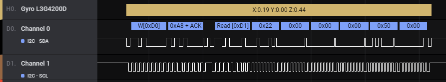

# Example Gyroscope HLA

This example HLA (High Level Analyzer) decodes i2c traffic from the [L3G4200D motion sensor](https://www.sparkfun.com/products/retired/10612) ([datasheet](http://cdn.sparkfun.com/datasheets/Sensors/Gyros/3-Axis/CD00265057.pdf)), and can be used as a reference for your writing your own HLA.

For documentation and information about High Level Analyzers in general, please see [README.md](../README.md).

## Extension Files
The example extension itself can be found in the `extension` directory. It includes the 2 required files to create an HLA:

  - `Hla.py` - A python file implementing the logic for the decoding i2c traffic from the L3G4200D motion sensor.
  - `extension.json` - Metadata about the extension, including paths to the included python extension (in this case, we just have `Hla.py`)

## Try it for yourself

To try this extension out for yourself, you will need:

 1. The example capture file at [files/i2c_gyro_2.2.5.sal](files/i2c_gyro_2.2.5.sal), which you and load into Logic 2 (2.2.6 and above - you can get a copy at https://discuss.saleae.com/).
 1. The files in the `extension` directory - `extension.json` and `Hla.py`. You will need to make sure they are in their own folder.

To try out the extension once you you have the necessary files, you will need to:

 1. Open Logic 2 (2.2.6 or greater)
 2. Add the extension
    1. Open the extensions panel by clicking on the extension icon on the right sidebar
    2. Click the + button in the upper right
    3. Click the "Select .json file" button and navigate to the `extension.json` file that you saved above
    4. That's it - `Gyro L3G4200D` should now show up in your list of extensions
 3. Load the capture that you downloaded above
    1. Click the menu button in the bottom right and select "Open Capture"
    2. Navigate to the `.sal` file you downloaded above, and open it
 4. Add the Gyro HLA that we just loaded as an extension
    1. Open the analyzers panel by clicking on the analyzer icon on the right sidebar
    2. Click on the + button in the upper right, then navigate to and click on "Gyro L3G4200D"
    3. In the popup, select the I2C analyzer as input to the HLA
    4. Click Finish

You should now see both the raw I2C traffic on `Channel 0`, and the decoded gyro trawffic on `Gyro L3G4200D` - it should look something like the screenshot below.

## What's next?

Try making modifications to the `Hla.py` file to see how it changes the output! As a start, you can modify the format string in the `set_settings` method in the `Gyro` class - there's a commented out line that shows how you can print out all of the raw register values read from the i2c traffic.
